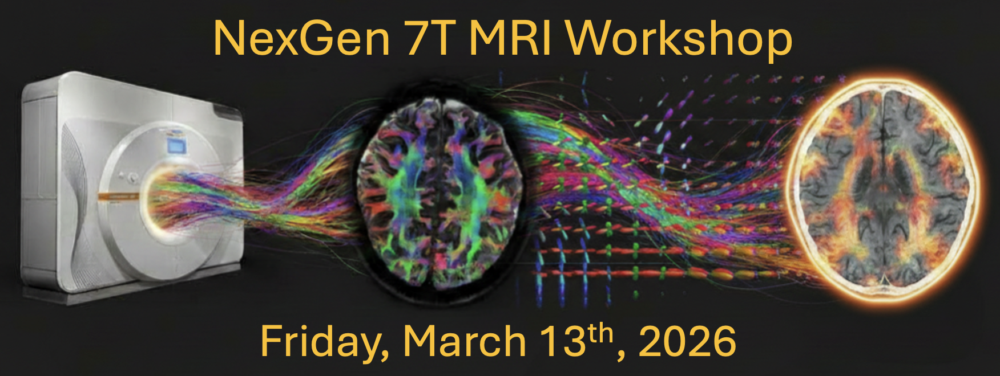

Please join us for the NexGen 7T MRI Workshop at UC Berkeley on Friday, March 13, 2026. The workshop is designed to present state-of-the-art MRI research, welcome potential new users and collaborators, and showcase research successfully performed using the NexGen 7T scanner through the NIH BRAIN U24 Integration and Dissemination Initiative. Participants are invited to attend either in person on the UC Berkeley Campus or remotely.

    <figure class="lab-basics-figure">
      
      <figcaption>Registration deadline: Friday, March 6, 2026</figcaption>
    </figure>

Program details: <a href="https://docs.google.com/document/d/1a14EcH7qWCxNqzUXzmyN4-jRtTYbxaOHotH-gbWBCng/edit?tab=t.0" target="_blank">NexGen 7T Workshop Agenda</a>.
Registration: Registration for virtual attendance will open soon
Remote access: Zoom link will be emailed to registered participants before the event date.
Location (in person): LKS545, Li Ka Shing Center & Weill 177, Weill Hall, UC Berkeley Campus

The NexGen 7 Tesla MRI scanner at UC Berkeley is a one-of-a-kind resource built specifically for ultra-high-resolution structural and functional neuroimaging at the scale of cortical laminae and columnar neurocircuit organization (mesoscale). Developed by an international team led by Professor David Feinberg (UC Berkeley Department of Neuroscience), in partnership with Siemens and supported by the NIH BRAIN Initiative, UC Berkeley, and Weill Neurohub, the platform integrates multiple advances that deliver synergistic gains in speed, resolution, and MR signal.

Key innovations include a high-performance head-only gradient coil designed for faster, stronger encoding while avoiding peripheral nerve stimulation, paired with high-density receiver arrays that enable exceptional spatial resolution and rapid imaging. The system has been validated in reproducible mesoscale fMRI using GE-EPI and VASO, and the stronger gradients also improve diffusion imaging by supporting higher diffusion weighting with shorter echo times, better coverage, higher temporal resolution, and reduced image distortions.

As part of the NIH BRAIN U24 effort, we are building the infrastructure to support broad and efficient use of the scanner—enabling in-person and remote access, user training, efficient data transfer and analysis workflows, and partnership development for national and international teams across neuroscience, engineering, physics, and clinical research. We welcome collaborations spanning fundamental human neurocircuitry, brain microstructure, and applications relevant to neurological and psychiatric diseases.

We hope you can attend and connect with the growing NexGen 7T user community. Please register by March 6, and feel free to share this invitation with colleagues who may be interested in ultra-high-resolution human neuroimaging and collaborative access to the NexGen 7T scanner.

Sincerely,
NexGen 7T MRI Team
nexgen7T@berkeley.edu
